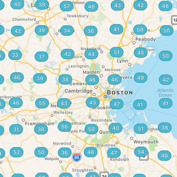

# BentoMap
> Map Clustering for Swift

[](https://travis-ci.org/Raizlabs/BentoMap)
[](http://cocoapods.org/pods/BentoMap)
[](http://cocoapods.org/pods/BentoMap)
[](http://cocoapods.org/pods/BentoMap)
[](https://github.com/Carthage/Carthage)

BentoMap is an implementation of [quadtrees][wiki] originally implemented for map annotation clustering and storage written in Swift. It expanded to allow other data that can be represented with 2D coordinates to conform to a protocol and be added into `BentoBox` containers.

For more information, check out the [Raizlabs Developer Blog][rl]. The Android equivalent, known as "Marker Clustering," is [documented here][mk].

[wiki]: https://en.wikipedia.org/wiki/Quadtree
[rl]: https://www.raizlabs.com/dev/2016/08/introducing-bentomap/
[mk]: https://developers.google.com/maps/documentation/android-api/utility/marker-clustering



## Features

- [x] Store annotation data in QuadTrees
- [x] Fetch annotations in a region, with a clustering threshold
- [x] Protocols for storing other data types

## Requirements

- iOS 9.0+
- Xcode 8.0

## Installation

#### CocoaPods
You can use [CocoaPods][cp] to install `BentoMap` by adding it to your `Podfile`:

```ruby
platform :ios, '9.0'
use_frameworks!
pod 'BentoMap'
```

#### Carthage
Create a `Cartfile` that lists the framework and run `carthage update`. Follow the [instructions][carthage] to add `$(SRCROOT)/Carthage/Build/iOS/BentoMap.framework` to an iOS project.

```ogdl
github "Raizlabs/BentoMap"
```

#### Manually
1. Download all of the `.swift` files in `BentoMap/` and `BentoMap/Extensions/` and drop them into your project.  
2. Congratulations!  


[cp]: http://cocoapods.org/
[carthage]: https://github.com/Carthage/Carthage#if-youre-building-for-ios

## Usage example

To see a full implementation of loading data into a map view, check out the [example project][ex].

### Inserting Data

```swift
import BentoMap

static var sampleData: QuadTree<Int, MKMapRect, MKMapPoint> {
    var samples = QuadTree<Int, MKMapRect, MKMapPoint>(bentoBox: BentoBox(minPoint: MKMapPointForCoordinate(CLLocationCoordinate2D.minCoord), maxPoint: MKMapPointForCoordinate(CLLocationCoordinate2D.maxCoord)), bucketCapacity: 5)
    let randomData = (1...5000).map { count in
        return QuadTreeNode(originCoordinate: MKMapPointForCoordinate(CLLocationCoordinate2D.randomCoordinate()), content: count)
    }
    for node in randomData {
        samples.insertNode(node)
    }
    return samples
}

```

### Updating a Map View

```swift
func updateAnnotations(inMapView mapView: MKMapView,
                                 forMapRect root: MKMapRect) {
    guard !mapView.frame.isEmpty && !MKMapRectIsEmpty(root) else {
        mapView.removeAnnotations(mapView.annotations)
        return
    }
    let zoomScale = Double(mapView.frame.width) / root.size.width
    let clusterResults = mapData.clusteredDataWithinMapRect(root,
                                    zoomScale: zoomScale,
                                    cellSize: Double(MapKitViewController.cellSize))
    let newAnnotations = clusterResults.map(BaseAnnotation.makeAnnotation)

    let oldAnnotations = mapView.annotations.flatMap({ $0 as? BaseAnnotation })

    let toRemove = oldAnnotations.filter { annotation in
        return !newAnnotations.contains { newAnnotation in
            return newAnnotation == annotation
        }
    }

    mapView.removeAnnotations(toRemove)

    let toAdd = newAnnotations.filter { annotation in
        return !oldAnnotations.contains { oldAnnotation in
            return oldAnnotation == annotation
        }
    }

    mapView.addAnnotations(toAdd)
}
```

[ex]: https://github.com/Raizlabs/BentoMap/blob/develop/BentoMapExample/App/MapKitViewController.swift

## Contributing

Issues and pull requests are welcome! Please ensure that you have the latest [SwiftLint][sl] installed before committing and that there are no style warnings generated when building.

Contributors are expected to abide by the [Contributor Covenant Code of Conduct][cc].

[sl]: https://github.com/realm/SwiftLint
[cc]: https://github.com/Raizlabs/BentoMap/blob/develop/CONTRIBUTING.md

## License

BentoMap is available under the MIT license. See the `LICENSE` file for more info.

## Authors

- Michael Skiba: <mailto:mike.skiba@raizlabs.com>, [@atelierclkwrk][mstw]
- Rob Visentin: <mailto:rob.visentin@raizlabs.com>
- Matt Buckley: <mailto:matt.buckley@raizlabs.com>, [@mattthousand][mbtw]

[mstw]: https://twitter.com/atelierclkwrk
[mbtw]: https://twitter.com/mattthousand
